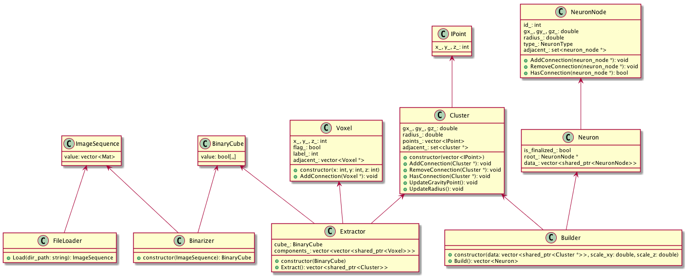

## Note

Before push, please run `./tools/cppformat.sh` and `./tools/lint.sh`.

## Architecture

* Loader :: (ImageFiles | VisiocyteMemory) -> ImageSequence
* Binarizer :: ImageSequence -> BinaryCube
* Extractor :: BinaryCube -> Cluster
* Builder :: Cluster -> Neuron
* Writer :: Neuron -> (SwcFile | VisiocyteMemory)



## How to use `NeuronTree`

1. declare `NeuronTree nt`
2. set `nt.name` and `nt.comment`
3. describe `infostring` as needed
4. declare `NeuronSWC pt`
5. set `pt.n`, `pt.type`, `pt.x`, `pt.y`, `pt.z`, `pt.r`, `pt.pn`
6. append `pt` to `nt.listNeuron`

types

* 0-Undefined
* 1-Soma
* 2-Axon
* 3-Dendrite
* 4-Apical Dendrite
* 5-Fork Point
* 6-End Point
* 7-Custom

references

* `NeuronSWC` at `visiocyte_main/basic_c_fun/basic_surf_objs.h`
* `writeSWC_file` at `visiocyte_main/basic_c_fun/basic_surf_objs.cpp`

## How to handle `Image4DSimple` from `callback.getImage(curwin)`

```
VISIOCYTELONG su = img->getUnitBytes();
VISIOCYTELONG sx = img->getXDim();
VISIOCYTELONG sy = img->getYDim();
VISIOCYTELONG sz = img->getZDim();
VISIOCYTELONG sc = img->getCDim();

VISIOCYTELONG stride_x = su;
VISIOCYTELONG stride_y = su*sx;
VISIOCYTELONG stride_z = su*sx*sy;
VISIOCYTELONG stride_c = su*sx*sy*sz;

visiocyte_uint8 ptr = img->getRawData()
return ptr[stride_x*x + stride_y*y + stride_z*z + stride_c*c]
```

references

* `Image4DProxy#at` at `visiocyte_main/basic_c_fun/basic_4dimage.h`

## How to configure CMake in debug mode

```
cd path/to/visiocyte_sigen/build
cmake -DCMAKE_BUILD_TYPE=Debug -DBUILD_MAIN=ON ..
```

## How to Calculate Coverage

```
cd path/to/visiocyte_sigen/build
gcovr --html --html-detail -r .. -o coverage.html
```

## OSX Qt Compile

```
/usr/local/Trolltech/Qt-4.7.1/bin/qmake
```

## Doxygen

```
doxywizard Doxyfile
```

## CppCheck

```
cppcheck --enable=all src/**/*.cpp
```

## TODO

* https://code.google.com/p/visiocyte/wiki/PluginDesignGuide
